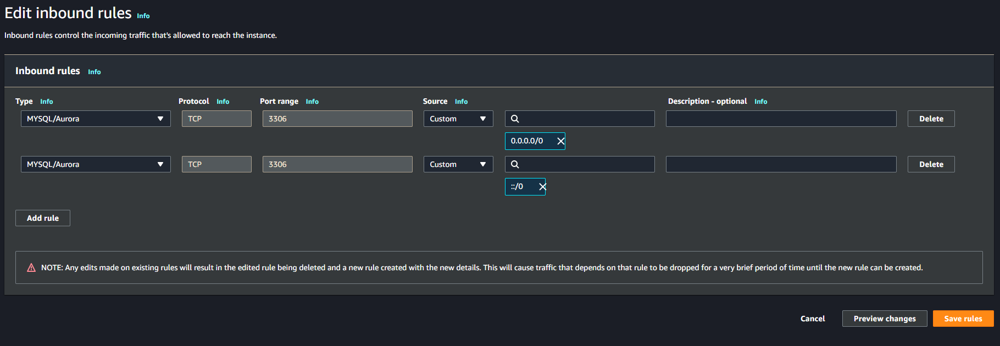
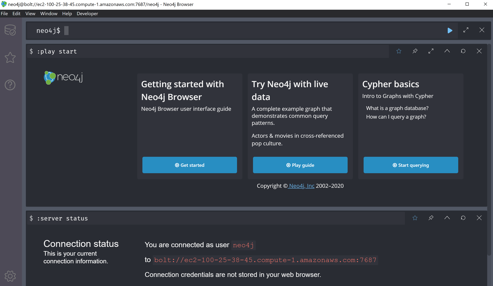

# Database information and guide

## Setting up MySQL Server on AWS

### Database Initialization on Amazon RDS Console
- Create an account on AWS as a "root user": https://www.aws.amazon.com/console
- Follow the instructions for creation of an RDS free-tier database: https://aws.amazon.com/getting-started/hands-on/create-mysql-db/
    - Select MySQL workbench under "Engine options"
    - Select "Free tier" under "Templates"
    - Enter root access credentials and make sure to save them.
    - Select "db.t2.micro" under "Burstable classes" in "DB instance size"
    - All other configurations remain the same

### Enabling global connections on Amazon RDS Console (NOT SECURE!)
- In AWS Console, head to RDS and select the initialized database
- Under "Connectivity & security", in the "Security" section, click on the URL for the VPC security group that you have selected
- Click on the "security group ID" that corresponds to the VPC used by the RDS instance
- Under "Inbound rules", click on "Edit inbound rules"
- Click on "Add rule" and set the rules to be as below:

### Enabling functions, triggers, and procedures
- RDS does not allow function, trigger, and procedure creation by default.
- Follow the steps at https://aws.amazon.com/premiumsupport/knowledge-center/rds-mysql-functions/ to enable creation and usage of these.

### Connecting to RDS through MySQL Workbench:
- Follow the instructions at https://docs.aws.amazon.com/AmazonRDS/latest/UserGuide/USER_ConnectToInstance.html for MySQL Workbench.

### Connecting to RDS through Python code:
- Refer to `server/README.md` for instructions on this.

## Files and directories:
- `schema_setup.sql`- creates all tables for the database. Should be executed before everything else.
- `class_frequency_view.sql`- finds the rating for every class per semester.
- `top_class_frequency_procedure.sql`- finds the semester when a class is most often taken.
- `convert_semester.sql`- contains a function for auto-converting a text semester to a numerical representation.
- `semester_offset_trigger.sql`- creates a trigger for auto-calculating the semester offset whenever a new enrollment is stored.
- `mysql_engine.py`- a wrapper engine for interacting with a MySQL RDS instance.
- `neo4j_engine.py`- a wrapper engine for interacting with a Neo4J remote DBMS.
- `initialize_courses.py`- uploads all courses to the MySQL RDS instance.
- `initialize_prereqs.py`- parses thru downloaded CSVs and uploads relationships to the Neo4J database.

## Setting up Neo4J Server on AWS

### Database initialization
Since hosting a Neo4J RDS instance on AWS is paid, we will instead use a Docker container on our EC2 instance. This setup is already handled
for the prerequisites database through use of the `server/setup.sh` script- make sure you run this first!

### Connecting to Neo4J using Neo4J Desktopp:
- Download Neo4J Desktop.
- Create a new project that will contain all of the graph database connections.
- Select "Add a new database" and choose "Connect to Remore DBMS".
- Set the name of the database.
- Replace `localhost` with the IP address of the instance.
- Enter "neo4j" as the username and "test" as the password, then connect and open.
- You should see a screen similar to this:

## Running Cypher commands on AWS
- SSH into the EC2 instance. See `server/README.md` for details.
- Queries and commands can be executed with the format `cypher-shell -u neo4j -p test "YOUR QUERY HERE"`.
