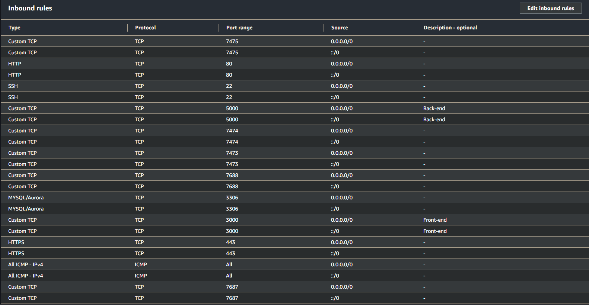

# Database information and guide

## Setting up MySQL Server on AWS

### Database Initialization on Amazon RDS Console
- Create an account on AWS as a "root user": https://www.aws.amazon.com/console
- Follow the instructions for creation of an RDS free-tier database: https://aws.amazon.com/getting-started/hands-on/create-mysql-db/
    - Select MySQL workbench under "Engine options"
    - Select "Free tier" under "Templates"
    - Enter root access credentials and make sure to save them.
    - Select "db.t2.micro" under "Burstable classes" in "DB instance size"
    - All other configurations remain the same

### Enabling global connections on Amazon RDS Console (NOT SECURE!)
- In AWS Console, head to RDS and select the initialized database
- Under "Connectivity & security", in the "Security" section, click on the URL for the VPC security group that you have selected
- Click on the "security group ID" that corresponds to the VPC used by the RDS instance
- Under "Inbound rules", click on "Edit inbound rules"
- Click on "Add rule" and set the IP address to be as below:

### Connecting to RDS through MySQL Workbench:
- Follow the instructions at https://docs.aws.amazon.com/AmazonRDS/latest/UserGuide/USER_ConnectToInstance.html for MySQL Workbench.

### Connecting to RDS through Python code:
- Refer to `backend-code/README.md` for instructions on this.

## Files and directories:
- `schema_setup.sql`- creates all tables for the database
